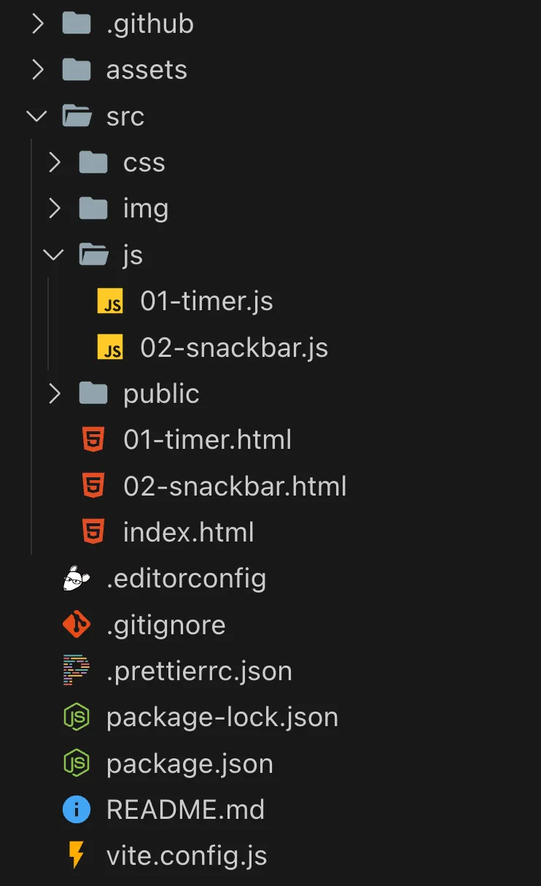
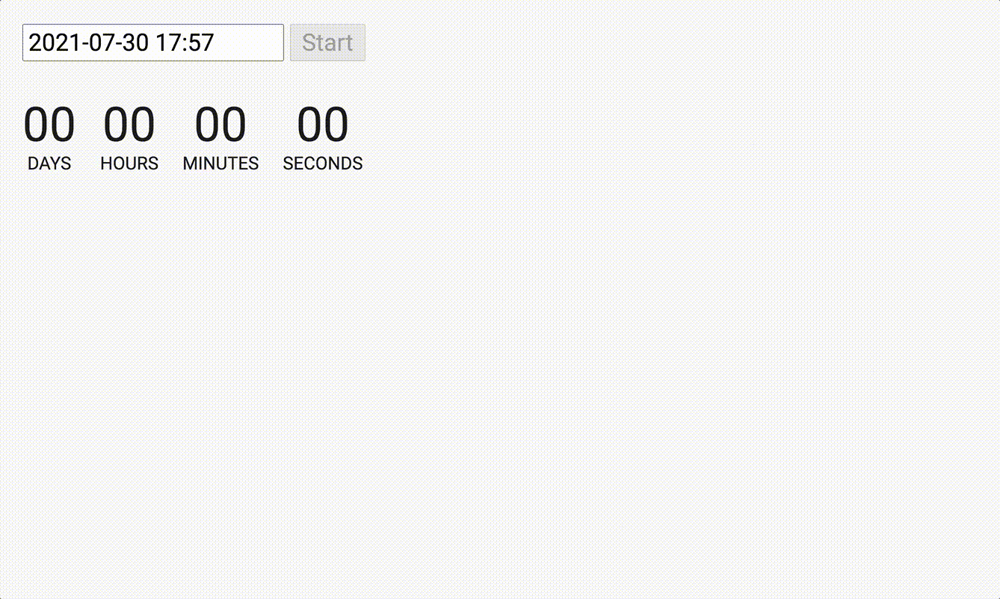
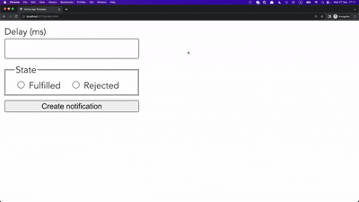

# GOIT-JS-HW-10 🚀

Welcome to Module 10! This is where we dive deep into the world of asynchronous JavaScript.

- Create a repository named `goit-js-hw-10`.
- Build the project using [Vite](https://vite.dev/). We have prepared and recommend using this [template](https://github.com/goitacademy/vanilla-app-template) for a pre-configured build.
- Read the task and implement it in your code editor.
- Ensure your code is formatted with `Prettier` and that there are no errors or warnings in the console when you open the live page.
- Submit your homework for review.

**Submission Format:** The homework must include two links: one to the source files and one to the live page on `GitHub Pages`.
The structure of project folders and files in the `src` folder should be as follows:



---

## Task 1. Countdown Timer ⏱️

Complete this task in the `01-timer.html` and `01-timer.js` files. Write a timer that counts down to a specific date. This type of timer can be used in blogs, online stores, event registration pages, during technical maintenance, etc. Check out the demo video of the timer in action.



### UI Elements

Add a timer, a date selection field, and a button to the HTML file that will start the timer when clicked. Style the UI elements according to the provided template.

```html
<input type="text" id="datetime-picker" />
<button type="button" data-start>Start</button>

<div class="timer">
  <div class="field">
    <span class="value" data-days>00</span>
    <span class="label">Days</span>
  </div>
  <div class="field">
    <span class="value" data-hours>00</span>
    <span class="label">Hours</span>
  </div>
  <div class="field">
    <span class="value" data-minutes>00</span>
    <span class="label">Minutes</span>
  </div>
  <div class="field">
    <span class="value" data-seconds>00</span>
    <span class="label">Seconds</span>
  </div>
</div>
```

### `flatpickr` Library

Use the [flatpickr](https://flatpickr.js.org/) library to allow the user to select an end date and time in a cross-browser way. To include the library's CSS code in the project, you need to add another import in addition to what is specified in the documentation.

```javascript
// As described in the documentation
import flatpickr from "flatpickr";
// Additional import for styles
import "flatpickr/dist/flatpickr.min.css";
```

The library expects to be initialized on an `input[type="text"]` element, so we have added `input#datetime-picker` to the HTML document.

```javascript
<input type="text" id="datetime-picker" />
```

The `flatpickr(selector, options)` function's second argument is an optional object of parameters. We have prepared the object you will need to complete the task. Understand what each property means in the [“Options” documentation](https://flatpickr.js.org/options/) and use it in your code.

```javascript
const options = {
  enableTime: true,
  time_24hr: true,
  defaultDate: new Date(),
  minuteIncrement: 1,
  onClose(selectedDates) {
    console.log(selectedDates[0]);
  },
};
```

### Date Selection Logic

The `onClose()` method from the options object is called every time the UI element created by `flatpickr` is closed. It is important to handle the user-selected date here. The `selectedDates` parameter is an array of selected dates, so we take the first element, `selectedDates[0]`.

You will also need this selected date outside of the `onClose()` method. Therefore, define a `let` variable outside of it, for example `userSelectedDate`, and after validating the date (past/future) in the `onClose()` method, save it to this `let` variable.

- If the user selects a date in the past, show a `window.alert()` with the text `"Please choose a date in the future"` and disable the "Start" button.
- If the user selects a valid date (in the future), the "Start" button becomes enabled.
- The "Start" button must be disabled until the user selects a date in the future. If a valid date is selected, the timer does not start, and if an invalid date is subsequently selected, the button should become disabled again.
- Clicking the "Start" button begins the countdown to the selected date.

### The Timer

When the "Start" button is clicked, the script should calculate the time remaining until the specified date once per second and update the timer interface, displaying four numbers: days, hours, minutes, and seconds in the format `xx:xx:xx:xx`.

- The number of days can be more than two digits.
- The timer should stop when it reaches the end date, i.e., when the timer shows `00:00:00:00`.

**LET'S NOT SIMPLIFY:** If the timer is started, to select a new date and restart the timer, the page must be reloaded.

Use the provided `convertMs` function to calculate the values, where `ms` is the difference between the specified and current date in milliseconds.

```javascript
function convertMs(ms) {
  // Number of milliseconds per unit of time
  const second = 1000;
  const minute = second * 60;
  const hour = minute * 60;
  const day = hour * 24;

  // Remaining days
  const days = Math.floor(ms / day);
  // Remaining hours
  const hours = Math.floor((ms % day) / hour);
  // Remaining minutes
  const minutes = Math.floor(((ms % day) % hour) / minute);
  // Remaining seconds
  const seconds = Math.floor((((ms % day) % hour) % minute) / second);

  return { days, hours, minutes, seconds };
}
```

### Time Formatting

The `convertMs()` function returns an object with the remaining time until the end date. It does not format the result. For example, if there are 4 minutes or any other time unit left, the function will return `4`, not `04`. In the timer interface, it is necessary to add a `0` if the number has fewer than two characters. Write a function, for example, `addLeadingZero(value)`, which will use the string method `padStart()` before formatting the value.

### Notification Library

To display messages to the user, use the `iziToast` library instead of `window.alert()`.

### Mentor's Checklist:

- `flatpickr` and `iziToast` libraries are included.
- The 'Start' button is disabled on initial page load.
- Clicking the input opens a calendar for date selection.
- If a past date is selected, the 'Start' button is disabled, and a notification "Please choose a date in the future" is displayed.
- If a future date is selected, the 'Start' button is enabled.
- When the 'Start' button is clicked, it becomes disabled, and the time remaining until the selected date is displayed on the page in the `xx:xx:xx:xx` format, starting the countdown.
- The interface updates every second, refreshing the remaining time data.
- The timer stops when it reaches the end date, meaning the remaining time is zero, and the interface shows `00:00:00:00`.
- The time in the interface is formatted, and a `0` is added to the beginning if a number has fewer than two characters.

---

## Task 2. Promise Generator ✨

Complete this task in the `02-snackbar.html` and `02-snackbar.js` files. Watch the demo video of the promise generator.



Add form markup to the HTML file. The form includes an input for delay in milliseconds, two radio buttons to determine how the promise should resolve, and a `submit` button to create the promise.

```html
<form class="form">
  <label>
    Delay (ms)
    <input type="number" name="delay" required />
  </label>

  <fieldset>
    <legend>State</legend>
    <label>
      <input type="radio" name="state" value="fulfilled" required />
      Fulfilled
    </label>
    <label>
      <input type="radio" name="state" value="rejected" required />
      Rejected
    </label>
  </fieldset>

  <button type="submit">Create notification</button>
</form>
```

Write a script that creates a promise when the form is submitted. Inside the promise's callback, it should either fulfill or reject after the delay specified by the user, depending on the selected radio button. The value passed to `resolve`/`reject` should be the delay time in milliseconds.

The created promise must be handled correctly (success or failure).
When the promise is successfully fulfilled, log the following text to the console, where `delay` is the promise's delay value.

```text
`✅ Fulfilled promise in ${delay}ms`
```

If the promise is rejected, log the following line to the console, where `delay` is the promise's delay value in milliseconds.

```text
`❌ Rejected promise in ${delay}ms`
```

### Notification Library

Use the `iziToast` library to display messages instead of `console.log()`. To include the library's CSS code in the project, you need to add an additional import as documented.

```javascript
// As described in the documentation
import iziToast from "izitoast";
// Additional import for styles
import "izitoast/dist/css/iziToast.min.css";
```

### Mentor's Checklist:

- The `iziToast` library is connected.
- When a state is selected in the radio buttons and the 'Create notification' button is pressed, a notification with the specified delay and style is shown.
- The displayed notification includes the type of the selected state and the delay time in milliseconds, according to the template in the instructions.
